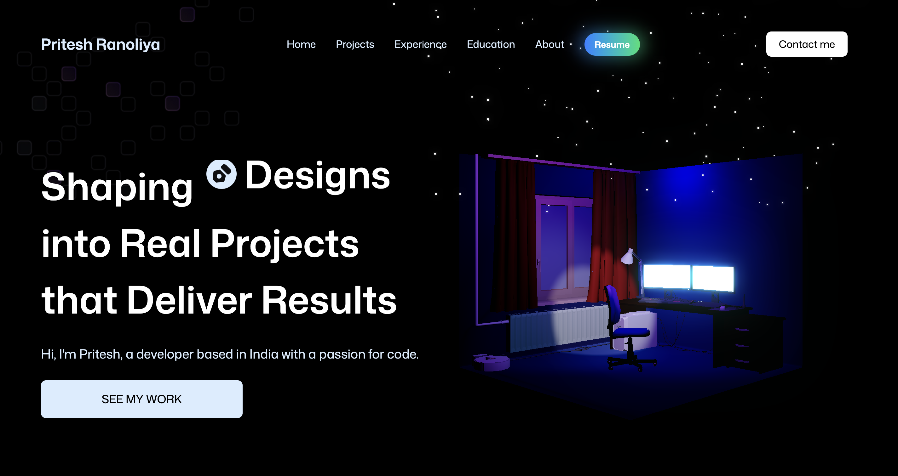

# Pritesh Ranoliya – 3D Portfolio

 <!-- Replace with actual screenshot -->

A modern, interactive **3D portfolio website** built with **React, Vite, TailwindCSS, Three.js, and Spline**, featuring a contact form powered by **EmailJS** and responsive dark-themed design.

---

## Table of Contents

* [Demo](#demo)
* [Features](#features)
* [Tech Stack](#tech-stack)
* [Installation](#installation)
* [Environment Variables](#environment-variables)
* [Usage](#usage)
* [Deployment](#deployment)
* [Folder Structure](#folder-structure)
* [Contributing](#contributing)
* [License](#license)

---

## Demo

🔗 Live Demo: [https://pritesh-portfolio-two.vercel.app/](https://pritesh-portfolio-two.vercel.app/)
 <!-- Replace with actual screenshot -->

---

## Features

* Fully **responsive portfolio** with dark mode support
* **Interactive 3D models** using Spline / Three.js
* Contact form with **EmailJS integration**
* **Dark-themed SweetAlert2** popups for success/error
* Built with **Vite for fast build and development**
* Mobile-friendly and performant

---

## Tech Stack

* **Frontend:** React, Vite, TailwindCSS
* **3D & Animations:** Three.js, @react-three/fiber, @react-three/postprocessing, Spline
* **Email Integration:** EmailJS
* **Deployment:** Vercel

---

## Installation

1. Clone the repository:

```bash
git clone https://github.com/priteshranoliya/pritesh_portfolio.git
cd pritesh_portfolio
```

2. Install dependencies:

```bash
npm install --legacy-peer-deps
```

> `--legacy-peer-deps` ensures compatibility with Three.js / React Three packages.

3. Run locally:

```bash
npm run dev
```

Open [http://localhost:5173](http://localhost:5173) in your browser.

---

## Environment Variables

Create a `.env` file in the root:

```env
VITE_APP_EMAILJS_SERVICE_ID=service_x9s15lj
VITE_APP_EMAILJS_TEMPLATE_ID=template_ltr1x1k
VITE_APP_EMAILJS_PUBLIC_KEY=X9gKpu6WnD76-ZLna
```

> **Do not commit `.env`** to GitHub. Add these as **Environment Variables in Vercel** for production.

---

## Usage

* Navigate through sections to see your projects and 3D portfolio.
* Use the **contact form** to send messages. Success/error notifications appear with **dark-themed SweetAlert2**.
* 3D models are interactive; click and drag to rotate.

---

## Deployment

### Vercel Setup

1. Connect your GitHub repo to Vercel.
2. Set **Project Root**: `./`
3. **Install Command**: `npm install --legacy-peer-deps`
4. **Build Command**: `npm run build`
5. **Output Directory**: `dist`
6. Add environment variables (EmailJS) in Vercel dashboard.
7. Deploy.

---

## Folder Structure

```
3dPortfolioPritesh
├─ README.md
├─ eslint.config.js
├─ index.html
├─ package-lock.json
├─ package.json
├─ public
│  ├─ images
│  │  ├─ ai-startup-landing-page.png
│  │  ├─ alpha-modified.png
│  │  ├─ arrow-down.svg
│  │  ├─ arrow-right.svg
│  │  ├─ bg.png
│  │  ├─ book-cover.png
│  │  ├─ chat.png
│  │  ├─ client1.png
│  │  ├─ client2.png
│  │  ├─ client3.png
│  │  ├─ client4.png
│  │  ├─ client5.png
│  │  ├─ client6.png
│  │  ├─ code.svg
│  │  ├─ concepts.svg
│  │  ├─ dark-saas-landing-page.png
│  │  ├─ designs.svg
│  │  ├─ devices.png
│  │  ├─ exp1.png
│  │  ├─ exp2.png
│  │  ├─ exp3.png
│  │  ├─ fav.png
│  │  ├─ fb.png
│  │  ├─ github.png
│  │  ├─ github.svg
│  │  ├─ gold-star.png
│  │  ├─ grain.jpg
│  │  ├─ ideas.svg
│  │  ├─ image.png
│  │  ├─ insta.png
│  │  ├─ iot.png
│  │  ├─ iot3.png
│  │  ├─ jsm-logo.png
│  │  ├─ light-saas-landing-page.png
│  │  ├─ linkdin.svg
│  │  ├─ linkedin.png
│  │  ├─ logo1.png
│  │  ├─ logo2.png
│  │  ├─ logo3.png
│  │  ├─ logos
│  │  │  ├─ company-logo-1.png
│  │  │  ├─ company-logo-10.png
│  │  │  ├─ company-logo-11.png
│  │  │  ├─ company-logo-2.png
│  │  │  ├─ company-logo-3.png
│  │  │  ├─ company-logo-4.png
│  │  │  ├─ company-logo-5.png
│  │  │  ├─ company-logo-6.png
│  │  │  ├─ company-logo-7.png
│  │  │  ├─ company-logo-8.png
│  │  │  ├─ company-logo-9.png
│  │  │  ├─ git.svg
│  │  │  ├─ node.png
│  │  │  ├─ python.svg
│  │  │  ├─ react.png
│  │  │  └─ three.png
│  │  ├─ map.png
│  │  ├─ memoji-avatar-1.png
│  │  ├─ memoji-avatar-2.png
│  │  ├─ memoji-avatar-3.png
│  │  ├─ memoji-avatar-4.png
│  │  ├─ memoji-avatar-5.png
│  │  ├─ memoji-computer.png
│  │  ├─ memoji-smile.png
│  │  ├─ menu.svg
│  │  ├─ nirmaLogo-modified.png
│  │  ├─ person.png
│  │  ├─ project1.png
│  │  ├─ project2.png
│  │  ├─ project3.png
│  │  ├─ readme-bottom.png
│  │  ├─ readme.png
│  │  ├─ screen.mp4
│  │  ├─ seo.png
│  │  ├─ star.png
│  │  ├─ synergy-exp.png
│  │  ├─ synergy-logo.jpeg
│  │  ├─ synergy-modified.png
│  │  ├─ synergy.jpeg
│  │  ├─ task-project.jpeg
│  │  ├─ techrover_solutions_inc_logo-modified.png
│  │  ├─ techrover_solutions_inc_logo.jpeg
│  │  ├─ textures
│  │  │  └─ mat1.png
│  │  ├─ time.png
│  │  ├─ tindog.png
│  │  ├─ tr-logo-1.png
│  │  ├─ vasu_image.png
│  │  ├─ vasundhara-image.svg
│  │  ├─ vasundhara_infotech_logo.jpeg
│  │  ├─ vasundhara_infotech_logo.png
│  │  ├─ x.png
│  │  └─ x.svg
│  ├─ models
│  │  ├─ computer-optimized-transformed.glb
│  │  ├─ computer-optimized.glb
│  │  ├─ git-svg-transformed.glb
│  │  ├─ node-transformed.glb
│  │  ├─ optimized-room.glb
│  │  ├─ python-transformed.glb
│  │  ├─ react_logo-transformed.glb
│  │  └─ three.js-transformed.glb
│  ├─ resume.pdf
│  └─ vite.svg
├─ src
│  ├─ App.jsx
│  ├─ assets
│  │  ├─ icons
│  │  │  ├─ arrow-down.svg
│  │  │  ├─ arrow-up-right.svg
│  │  │  ├─ check-circle.svg
│  │  │  ├─ chrome.svg
│  │  │  ├─ css3.svg
│  │  │  ├─ github.svg
│  │  │  ├─ html5.svg
│  │  │  ├─ react.svg
│  │  │  ├─ sparkle.svg
│  │  │  ├─ square-js.svg
│  │  │  └─ star.svg
│  │  └─ images
│  │     ├─ ai-startup-landing-page.png
│  │     ├─ book-cover.png
│  │     ├─ dark-saas-landing-page.png
│  │     ├─ grain.jpg
│  │     ├─ light-saas-landing-page.png
│  │     ├─ map.png
│  │     ├─ memoji-avatar-1.png
│  │     ├─ memoji-avatar-2.png
│  │     ├─ memoji-avatar-3.png
│  │     ├─ memoji-avatar-4.png
│  │     ├─ memoji-avatar-5.png
│  │     ├─ memoji-computer.png
│  │     ├─ memoji-smile.png
│  │     └─ suratMap.png
│  ├─ components
│  │  ├─ Button.jsx
│  │  ├─ Card.jsx
│  │  ├─ CardHeader.jsx
│  │  ├─ GlowCard.jsx
│  │  ├─ HeroModels
│  │  │  ├─ HeroExperience.jsx
│  │  │  ├─ HeroLights.jsx
│  │  │  ├─ Particles.jsx
│  │  │  └─ Room.jsx
│  │  ├─ Models
│  │  │  └─ Contact
│  │  │     ├─ Computer.jsx
│  │  │     └─ ContactExperience.jsx
│  │  ├─ NavBar.jsx
│  │  ├─ Techicon.jsx
│  │  ├─ TitleHeader.jsx
│  │  └─ ToolBoxItems.jsx
│  ├─ constants
│  │  └─ index.js
│  ├─ index.css
│  ├─ main.jsx
│  └─ sections
│     ├─ About.jsx
│     ├─ Contact.jsx
│     ├─ Education.jsx
│     ├─ ExperienceSection.jsx
│     ├─ FeatureCards.jsx
│     ├─ Footer.jsx
│     ├─ Hero.jsx
│     └─ ShowcaseSection.jsx
└─ vite.config.js
```

---

## Contributing

Contributions are welcome!

1. Fork the repo
2. Create a new branch: `git checkout -b feature/my-feature`
3. Commit changes: `git commit -m "Add some feature"`
4. Push to branch: `git push origin feature/my-feature`
5. Open a Pull Request

---

## License

MIT License © Pritesh Ranoliya
